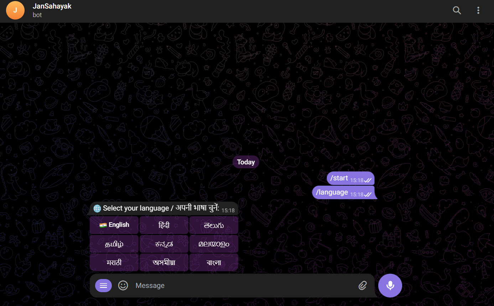
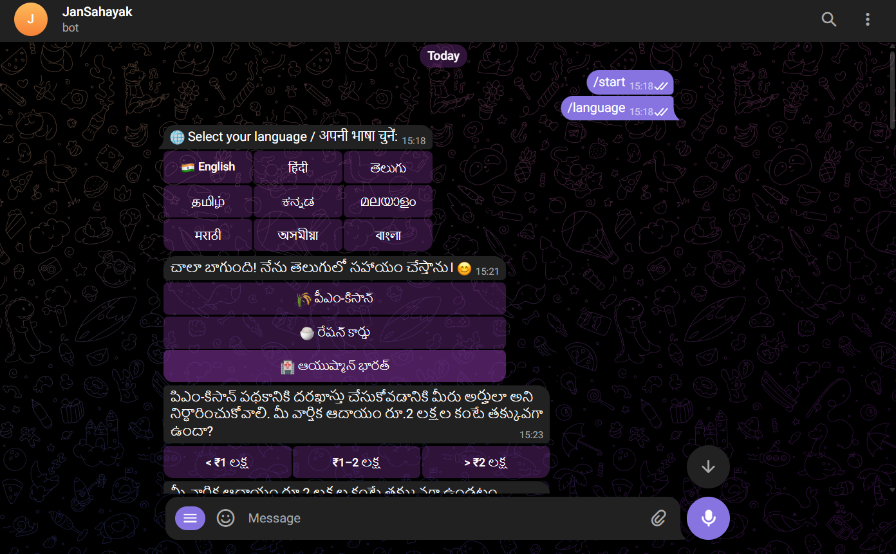
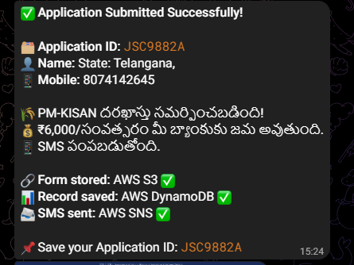
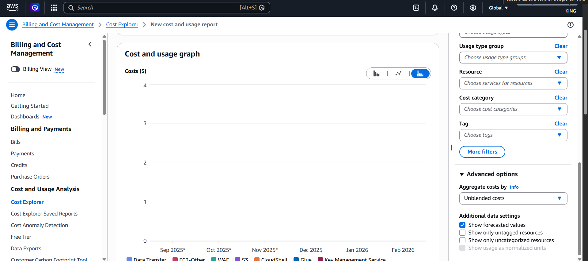
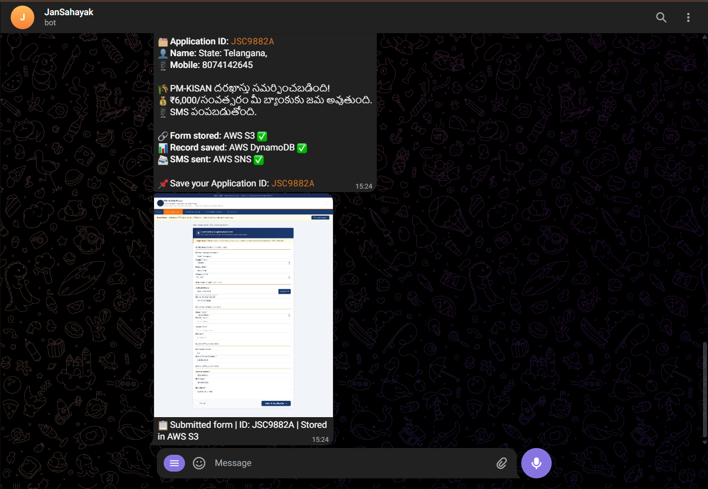

<div align="center">

# 🇮🇳 JanSahayak — जनसहायक
### *People's Helper*

**Apply by voice. In your language. In 3 minutes.**

[](https://t.me/JanSahayak_bot)
[](https://wa.me/)
[](https://aws.amazon.com/)
[](https://aws.amazon.com/bedrock/)
[](https://aws.amazon.com/ec2/)
[](https://hack2skill.com)

---

> **India has 14+ crore eligible PM-KISAN farmers. Only 11 crore are enrolled.**
> **3 crore miss out annually — not because they're ineligible, but because portals are complex.**
> **JanSahayak fixes this.**

</div>

---

## 🎯 The Problem

Rural citizens across India are eligible for welfare schemes but cannot access them because:

- Government portals are text-heavy, English-first, and require digital literacy
- Elderly and illiterate citizens cannot type or navigate web forms
- Expensive middlemen (₹200–500 per application) exploit this gap
- Even Hindi portals assume reading ability most rural users don't have

**JanSahayak eliminates every single one of these barriers.**

---

## 💡 The Solution

An **Agentic AI Caseworker** on Telegram and WhatsApp that:

1. **Speaks your language** — 9 Indian languages including Telugu, Hindi, Tamil, Kannada
2. **Asks you questions** — like a human caseworker, via voice or text
3. **Reads your Aadhaar** — just send a photo, AI extracts everything
4. **Fills the form for you** — RPA agent autonomously navigates the government portal
5. **Confirms via SMS** — real SMS confirmation sent to your mobile via Amazon SNS

**It doesn't tell you how to apply. It applies for you.**

---

## 🚀 Live Demo

| Platform | Link | Status |
|---|---|---|
| Telegram | [@JanSahayak_bot](https://t.me/JanSahayak_bot) | 🟢 Live 24/7 |
| WhatsApp | Via Twilio Sandbox | 🟢 Live |
| Server | AWS EC2 `3.88.113.30` | 🟢 Running |

---

## 📱 Screenshots

### 1. Language Selection + Scheme Menu (Telugu)
> Bot greets in Telugu, shows 9 language options, then presents available schemes



### 2. AI Interview — Eligibility Check
> Bot conducts smart interview in Telugu — income check, land size, employment status



### 3. Phone Number Confirmation
> User shares contact, bot confirms in native language


### 4. Aadhaar OCR — Amazon Textract
> User sends Aadhaar photo → AI reads name, DOB, gender, Aadhaar number automatically


### 5. Application Submitted — AWS Confirmation
> Complete confirmation with Application ID, AWS S3 ✅, DynamoDB ✅, SNS SMS ✅


### 6. Form Filled + Stored in AWS S3
> Screenshot of auto-filled PM-KISAN portal form, stored in Amazon S3



### 7. Real SMS via Amazon SNS
> Actual SMS received: "JanSahayak: Mee PM-KISAN darakhastu విజయవంతమైంది! ID: JSC9882A"



### 8. AWS S3 Console
> Live S3 bucket `jansahayak-vupo` storing form screenshots with AES-256 encryption



---

## 🏗️ Architecture

```
┌─────────────────────────────────────────────────────────────────┐
│                        USER LAYER                               │
│  Rural Citizen → Voice Note / Text / Aadhaar Photo             │
└──────────────────────┬──────────────────────────────────────────┘
                       │
          ┌────────────┴────────────┐
          │                         │
    ┌─────▼──────┐          ┌───────▼──────┐
    │  Telegram  │          │   WhatsApp   │
    │    Bot     │          │  via Twilio  │
    └─────┬──────┘          └───────┬──────┘
          └────────────┬────────────┘
                       │
┌──────────────────────▼──────────────────────────────────────────┐
│                   INTELLIGENCE LAYER                            │
│                                                                 │
│  ┌─────────────────────────────────────────────────────────┐   │
│  │          Amazon Bedrock — LLaMA 3.3 70B                 │   │
│  │   Intent Recognition │ Eligibility Check │ Interviewing │   │
│  │   Groq Whisper (fallback if Bedrock unavailable)        │   │
│  └─────────────────────────────────────────────────────────┘   │
│                                                                 │
│  ┌──────────────────┐    ┌──────────────────────────────────┐  │
│  │  Amazon Textract  │    │      Groq Whisper STT            │  │
│  │  Aadhaar OCR      │    │  9 Indian Languages, Real-time   │  │
│  │  + LLaMA 4 Scout  │    │  Amazon Transcribe (fallback)    │  │
│  │  (fallback)       │    └──────────────────────────────────┘  │
│  └──────────────────┘                                           │
└──────────────────────┬──────────────────────────────────────────┘
                       │
┌──────────────────────▼──────────────────────────────────────────┐
│                    ACTION LAYER                                 │
│                                                                 │
│  ┌─────────────────────────────────────────────────────────┐   │
│  │              RPA Agent (Selenium + ChromeDriver)        │   │
│  │  Opens Portal → Fills Form → Submits Application        │   │
│  │  PM-KISAN │ Ration Card │ Ayushman Bharat               │   │
│  └─────────────────────────────────────────────────────────┘   │
└──────────────────────┬──────────────────────────────────────────┘
                       │
┌──────────────────────▼──────────────────────────────────────────┐
│                   AWS SERVICES LAYER                            │
│                                                                 │
│  ┌──────────┐  ┌───────────┐  ┌─────────┐  ┌───────────────┐  │
│  │ Amazon S3 │  │ DynamoDB  │  │   SNS   │  │    AWS EC2    │  │
│  │Screenshots│  │  Profiles │  │   SMS   │  │  t2.micro     │  │
│  │  AES-256  │  │   & Apps  │  │9 langs  │  │  us-east-1    │  │
│  └──────────┘  └───────────┘  └─────────┘  └───────────────┘  │
│                                                                 │
│  ┌──────────────────────────────────────────────────────────┐  │
│  │        Firebase Firestore — Conversation History         │  │
│  └──────────────────────────────────────────────────────────┘  │
└─────────────────────────────────────────────────────────────────┘
                       │
┌──────────────────────▼──────────────────────────────────────────┐
│                      OUTPUT                                     │
│  ✅ Application ID  │  📸 Form Screenshot  │  📱 SMS via SNS   │
└─────────────────────────────────────────────────────────────────┘
```

---

## ☁️ AWS Services Used

| Service | Purpose | Status |
|---|---|---|
| **Amazon Bedrock** — LLaMA 3.3 70B | Primary LLM: multilingual conversations, intent recognition, eligibility reasoning | ✅ Live |
| **Amazon S3** | Form screenshots (AES-256 encrypted), Aadhaar storage | ✅ Live |
| **Amazon DynamoDB** | User profiles, application records | ✅ Live |
| **Amazon SNS** | SMS confirmation in 9 Indian languages | ✅ Live |
| **Amazon Textract** | Primary Aadhaar OCR, document understanding | ✅ Live |
| **Amazon Transcribe** | Voice STT fallback (9 Indian languages) | ✅ Integrated |
| **AWS EC2** | t2.micro, us-east-1, 24/7 hosting | ✅ Live |
| **AWS Kiro** | Spec-driven API development | ✅ Used |

---

## 🗂️ Supported Schemes

| Scheme | Status | Description |
|---|---|---|
| 🌾 **PM-KISAN** | ✅ Live | ₹6,000/year direct farmer benefit |
| 🍚 **Ration Card** | ✅ Live | Food security scheme |
| 🏥 **Ayushman Bharat** | ✅ Live | ₹5 lakh health insurance |

---

## 🌐 Languages Supported

| Language | Script | Voice | Text |
|---|---|---|---|
| English | Latin | ✅ | ✅ |
| हिंदी (Hindi) | Devanagari | ✅ | ✅ |
| తెలుగు (Telugu) | Telugu | ✅ | ✅ |
| தமிழ் (Tamil) | Tamil | ✅ | ✅ |
| ಕನ್ನಡ (Kannada) | Kannada | ✅ | ✅ |
| മലയാളം (Malayalam) | Malayalam | ✅ | ✅ |
| मराठी (Marathi) | Devanagari | ✅ | ✅ |
| অসমীয়া (Assamese) | Bengali | ✅ | ✅ |
| বাংলা (Bengali) | Bengali | ✅ | ✅ |

---

## 🔄 User Journey

```
User speaks in Telugu:
"పిఎం కిసాన్ కావాలి" (I want PM-KISAN)
         │
         ▼
Bot detects language → Conducts eligibility interview
         │
         ▼
"Aadhaar card photo pamandi" (Send Aadhaar photo)
         │
         ▼
Amazon Textract extracts: Name, DOB, Aadhaar No, Address
         │
         ▼
RPA Agent opens PM-KISAN portal in background
Fills all fields automatically using Selenium
         │
         ▼
✅ Application Submitted!
📸 Screenshot → Amazon S3
📋 Record → Amazon DynamoDB
📱 SMS → Amazon SNS: "Mee darakhastu విజయవంతమైంది! ID: JSC9882A"
```

---

## 💰 Cost Analysis

### Phase 1: Hackathon MVP
```
Amazon Bedrock (LLaMA 3.3 70B) : ₹0  (AWS credits)
Amazon Textract                 : ₹0  (1,000 pages free/month)
Amazon Transcribe               : ₹0  (60 min free/month)
Amazon S3                       : ₹0  (5GB free tier)
Amazon DynamoDB                 : ₹0  (25GB free tier)
Amazon SNS                      : ₹0  (1M requests free/month)
AWS EC2 t2.micro                : ₹0  (hackathon credits)
─────────────────────────────────────────
Total MVP Cost                  : ₹0 🎉
```

### Phase 2: District Pilot (5,000 users, 3 months)
```
Total Estimated Cost : ~₹1 Lakh
Unit Economics       : ₹20/application vs ₹200+ at CSC centers
ROI                  : 10x cheaper than existing alternatives
```

---

## ⚔️ Competitive Advantage

| Feature | JanSahayak | UMANG | MyScheme | CSC Kiosks | Gram Vaani |
|---|:---:|:---:|:---:|:---:|:---:|
| Voice Input | ✅ | ❌ | ❌ | ✅ Human | ✅ |
| 9 Indian Languages | ✅ | ❌ | Partial | ✅ Human | ❌ |
| Aadhaar OCR | ✅ | ❌ | ❌ | Human | Partial |
| **Automated Form Filling** | ✅ | ❌ | ❌ | Human | ❌ |
| WhatsApp Native | ✅ | ✅ | ✅ | ✅ | ✅ |
| Free to Use | ✅ | ✅ | ✅ | ✅ | ✅ |
| **AI Agent** | ✅ | ❌ | ❌ | ❌ | ❌ |

**JanSahayak is the only solution that fully automates end-to-end form submission.**

---

## 🛠️ Tech Stack

```
Backend         : Python 3.12 + FastAPI
Bot Framework   : python-telegram-bot + Twilio WhatsApp
LLM (Primary)   : Amazon Bedrock — LLaMA 3.3 70B
LLM (Fallback)  : Groq — LLaMA 3.3 70B Versatile
OCR (Primary)   : Amazon Textract + LLaMA 4 Scout
STT             : Groq Whisper large-v3 + Amazon Transcribe (fallback)
RPA             : Selenium + ChromeDriver
Database        : Amazon DynamoDB + Firebase Firestore
Storage         : Amazon S3 (AES-256)
Notifications   : Amazon SNS (SMS in 9 languages)
Hosting         : AWS EC2 t2.micro (us-east-1)
Dev Tools       : AWS Kiro (spec-driven development)
```

---

## 📁 Project Structure

```
JanSahayak/
├── main.py                    # FastAPI app entry point
├── polling_bot.py             # Telegram polling bot
├── aws_services.py            # All AWS integrations
├── laptop_rpa_worker.py       # RPA form filling agent
├── requirements.txt
├── translations.json          # 9-language translations
├── routers/
│   ├── telegram_webhook.py    # Telegram message handler
│   ├── whatsapp_webhook.py    # WhatsApp/Twilio handler
│   ├── chat.py                # LLM + conversation logic
│   ├── documents.py           # Aadhaar OCR pipeline
│   ├── rpa_queue.py           # RPA job queue + AWS triggers
│   └── memory.py              # Firebase conversation memory
├── mock_portal/               # NIC-styled demo portals
│   ├── pmkisan.html
│   ├── ration.html
│   └── ayushman.html
├── models/
│   ├── user.py
│   ├── application.py
│   └── message.py
└── services/                  # AWS service modules
    └── __init__.py
```

---

## ⚙️ Setup & Installation

### Prerequisites
- Python 3.12+
- AWS Account with credits
- Telegram Bot Token
- Twilio Account (WhatsApp)
- Firebase Project

### 1. Clone the Repository
```bash
git clone https://github.com/DHRUVASAI/JanSahayak-
cd JanSahayak-
```

### 2. Install Dependencies
```bash
pip install -r requirements.txt
```

### 3. Configure Environment Variables
Create a `.env` file:
```env
TELEGRAM_BOT_TOKEN=your_telegram_token
GROQ_API_KEY=your_groq_key
GROQ_API_KEY_2=your_groq_key_2
FIREBASE_CREDENTIALS_PATH=/path/to/firebase-credentials.json
AWS_ACCESS_KEY_ID=your_aws_key
AWS_SECRET_ACCESS_KEY=your_aws_secret
AWS_DEFAULT_REGION=us-east-1
TWILIO_ACCOUNT_SID=your_twilio_sid
TWILIO_AUTH_TOKEN=your_twilio_token
```

### 4. Start the Bot
```bash
# Start FastAPI server
nohup uvicorn main:app --host 0.0.0.0 --port 8000 &

# Start Telegram polling bot
nohup python3 polling_bot.py &

# Start mock portals
nohup python3 -m http.server 3000 --directory mock_portal &

# Start RPA worker (on local PC with Chrome)
python3 laptop_rpa_worker.py
```

---

## 🔐 Data Privacy & Security

JanSahayak is fully compliant with India's **DPDP Act 2023**:

| Data | Storage | Retention | Protection |
|---|---|---|---|
| Voice recordings | Processed & deleted immediately | 0 days | Never stored |
| Aadhaar photos | Amazon S3 | Session only | AES-256, masked key |
| Conversation history | Firebase Firestore | 7 days | Encrypted |
| Application records | Amazon DynamoDB | Permanent | Application ID only |
| Phone numbers | DynamoDB | Permanent | Partial masking in logs |

**No raw Aadhaar data is stored. Data stays within AWS India region.**

---

## 🗺️ Roadmap

### ✅ Phase 1 — Hackathon MVP (Now)
- Telegram + WhatsApp bots live
- 3 schemes: PM-KISAN, Ration Card, Ayushman Bharat
- Full AWS stack: Bedrock, S3, DynamoDB, SNS, Textract
- 9 Indian languages
- Voice + OCR + RPA pipeline complete

### 🔄 Phase 2 — District Pilot (3 Months)
- 10 central government schemes
- Amazon API Gateway for scalability
- 5,000 beneficiaries in one district
- DigiLocker integration
- Hardened RPA infrastructure

### 🚀 Phase 3 — National Scale (12 Months)
- 30+ schemes
- Official government APIs (replace RPA)
- AWS Auto Scaling
- 1M+ users
- CSC (Common Service Centre) partnership

---

## 👥 Team VUPO

| Name | Role |
|---|---|
| **V DhruvaSai** | Team Lead, Backend, RPA, AWS |
| **Pokuri Lahari** | AWS Services, API Integration |

**Institution:** Built for AWS AI for Bharat Hackathon 2026
**Track:** AI for Communities, Access & Public Impact

---

## 📊 Impact Metrics

```
Target Beneficiaries    : 3 Crore unenrolled PM-KISAN farmers
Application Time        : 45 minutes (manual) → 3 minutes (JanSahayak)
Cost per Application    : ₹200+ (CSC centers) → ₹20 (JanSahayak)
Digital Literacy Needed : High → Zero
Languages Supported     : 1 (portals) → 9 (JanSahayak)
```

---

## 📜 License

MIT License — See [LICENSE](LICENSE)

---

<div align="center">

**Built with ❤️ for Rural India**

*Powered by AWS | AI for Bharat Hackathon 2026*

[](https://t.me/JanSahayak_bot)

</div>


### AWS Console Proof


