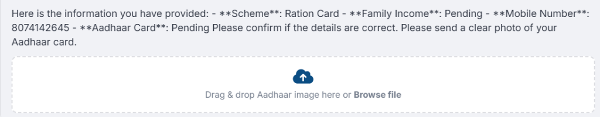
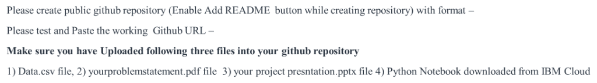
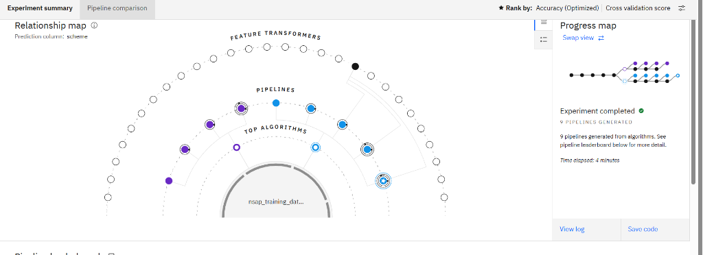
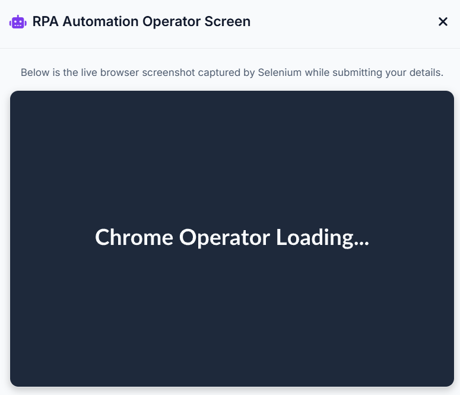
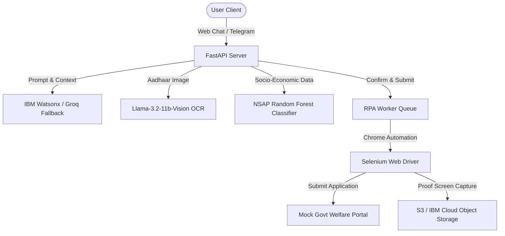

# 🌾 JanSahayak (जनसहायक) — National Welfare Schemes Assistant

JanSahayak is an AI-powered, multi-lingual welfare assistant designed to help citizens (especially in rural India) check eligibility, complete documents, and apply for government schemes using a conversational interface (both Web Chat and Telegram Bot).

---

## ✨ Features
1. **Interactive Multilingual Assistant**: Fully conversational in 9 Indian languages (English, Hindi, Telugu, Tamil, Marathi, Malayalam, Kannada, Bengali, and Assamese) with direct audio/text inputs.
2. **Automatic Aadhaar OCR (Llama 3.2 Vision)**: Real-time Aadhaar image extraction, processing, and info parsing. Sensitive details (e.g. Aadhaar numbers) are masked securely (`XXXX XXXX 1234`) before database storage.
3. **Machine Learning Classifier (NSAP)**: A multi-class Random Forest model that evaluates demographic and socio-economic variables to instantly align BPL applicants with the appropriate National Social Assistance Programme pension schemes (IGNOAPS, IGNWPS, IGNDPS, NFBS, Annapurna).
4. **End-to-End RPA Selenium Pipeline**: Runs background headless Chrome operators to dynamically fill welfare forms in real-time on government portals, capture confirmation screenshots, and save progress statuses to Firestore.

---

## 📷 Screenshots Gallery

| 🌐 JanSahayak Authentication | 💬 Multi-lingual Conversation |
|:---:|:---:|
|  |  |

| 📄 Document Upload & OCR | ⚙️ Automated RPA Portal Verification |
|:---:|:---:|
|  |  |

---

## 🛠️ Architecture & Tech Stack



### Backend & Databases
* **FastAPI**: Main high-performance API routing layer.
* **Google Firestore**: Secure, real-time application database for user profiles, session steps, conversation histories, and RPA states.
* **IBM Cloud Object Storage (COS / S3)**: Cloud repository for uploaded Aadhaar card attachments and operator confirmation screenshots.

### Artificial Intelligence & Models
* **IBM Watsonx.ai**: Powers natural language conversations (using `ibm/granite-3-3-8b-instruct` / Granite 3.3).
* **Llama 3.2 Vision (`llama-3.2-11b-vision-preview`)**: Handles real-time image OCR for demographic field extraction.
* **Random Forest Multi-Class Model (`nsap_model.joblib`)**: Predicts eligibility parameters and NSAP scheme selections.

---

## 🚀 Getting Started

### 1. Requirements
Install dependencies using virtualenv:
```bash
python -m venv venv
venv\Scripts\activate
pip install -r requirements.txt
```

### 2. Setup Environment Variables
Create a `.env` file in the root directory:
```env
# Watsonx Credentials
IBM_WATSONX_API_KEY=your_watsonx_api_key
IBM_WATSONX_PROJECT_ID=your_watsonx_project_id
IBM_WATSONX_URL=https://eu-gb.ml.cloud.ibm.com

# LLM Fallback & Vision Keys
GROQ_API_KEY=your_groq_api_key
TELEGRAM_BOT_TOKEN=your_telegram_bot_token

# Firebase Credentials
FIREBASE_CRED=firebase-credentials.json
```

### 3. Running the Project
Train the NSAP classifier model:
```bash
python train_nsap_model.py
```

Start the FastAPI backend:
```bash
uvicorn main:app --port 8000 --reload
```

Run the Telegram Bot listener:
```bash
python polling_bot.py
```

Load **[http://localhost:8000/](http://localhost:8000/)** in your browser to try out the interface!
